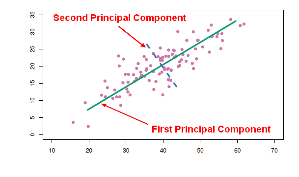

### Aprendizado não supervisionado

- Também conhecido como mineração de dados, que um sub-campo do Aprendizado de Máquina que foca mais em análise exploratória de dados.
- O aprendizado não supervisionado pode ser um objetivo em si mesmo (descobrir novos padrões nos dados) ou um meio para atingir um fim.

#### _Clustering_

- Técnica para fazer agrupamentos automáticos de dados segundo seu grau de semelhança. 
- O critério de semelhança faz parte da definição do problema.
- Tipos mais comuns: 
    - Particionais 
    - Hierárquicos

##### _Hierarquical Clustering_

No agrupamento hierárquico, os dois _clusters_ mais semelhantes são combinados e continuam a combinar até que todos os objetos estejam no mesmo _cluster_. 

O agrupamento hierárquico produz uma árvore (chamada de dendograma) que mostra a hierarquia dos _clusters_.

Opta-se por escolher os _clusters_ por quantidade de clusters ou por similaridade mínima.

Na _**Agglomerative**_ (abordagem "de baixo para cima") cada observação começa em seu próprio _cluster_, e pares de _clusters_ são mesclados à medida que se sobe na hierarquia.


**Distância**: Métrica para determinar a similaridade entre dois clusters / observações, com um valor entre 0 e 1.
    * Euclidiana (raiz do somatório dos quadrados das diferenças)

_**Linkage**_: Distância entre _'subclusters'_.
    * Máxima, Mínima, Média, etc

##### Exemplo

**Dados das TED talks**

```{r}
library(tidyverse)
library(jsonlite)

Sys.setlocale( locale = "pt_BR")

ted_data <- read_csv("data/ted_main.csv")
```

Vamos utilizar alguns dados ainda não explorados, as tags. Primeiro, será necessário extrair as tags da lista para uma variável

```{r}
ted_data %>%
  select( url, tags ) %>%
  mutate( url = str_replace( url, '\n', '' )  # Retira o Enter do final da URL
        , all_tags = tags %>% 
            str_replace_all( "\\[", '' ) %>%  # Colchetes
            str_replace_all( "\\]", '' ) %>%  # Colchetes
            str_replace_all( "'", "" ) %>%    # Delimitador de cada tag (aspas)
            str_split( pattern = ', ' ) ) %>% # Delimitador entre tags (vírgula seguida de espaço)
  unnest( all_tags ) %>%                      # Extrai a lista de tags para um novo campo
  mutate( tag = factor( all_tags )) %>%       # Converte para tipo Factor
  select( -tags, -all_tags ) -> ted_tags

# Vamos ver a contagem de tags
ted_tags %>%
  count( tag ) %>%
  arrange( desc( n )) 
```


```{r}
# E as estatísticas descritivas de quantidade de tags por vídeo

ted_tags %>%
  count( url ) %>%
  select( -url ) %>%
  pull( n ) %>%
  summary()
```

Identificamos que muitas tags foram utilizadas em diferentes vídeos. O que podemos aprender sobre os vídeos utilizando as tags?

```{r}
ted_tags %>%
  count( tag ) %>%
  top_n( 15 ) %>%
  mutate( tag = reorder(tag, n )) %>%
  ggplot( aes( tag, n, label = tag, fill = tag )) +
  geom_col( alpha = 0.9, show.legend = FALSE ) +
  geom_text( aes( tag, 0.001 ), hjust = 0, color = "white", size = 4, fontface = "bold" ) +
  coord_flip() +
  labs( x = NULL, y = "ocorrências" ) +
  theme_minimal() +
  theme( axis.text.y=element_blank() )
```

Clustering em R requer o uso de matrizes. Precisamos transformar a ocorrência de cada tag em uma coluna. 

Matrizes são de tipagem homogênea. As strings (tag, url) devem ser transformadas em nomes de colunas (tags) e linhas (urls).

Aplicaremos uma transformação em escalas para centralizar as medidas e converter todas contagens em uma mesma escala.

```{r}
sparse_tag_matrix <- ted_tags %>%
  mutate( val = 1L ) %>%
  spread( key = tag, value = val, fill = 0L ) %>% 
  column_to_rownames( "url" ) %>%
  as.matrix()

tags_scaled <- scale( sparse_tag_matrix )
```


##### __Clustering__ com as tags

Uma forma de determinar a similaridade entre os vídeos é utilizando a correlação entre eles. Vídeos com tags em comum terão correlação mais alta (tendendo a 1), e precisamos representar aqueles mais similares com valores tendendo a zero.  

```{r}
dissimilarity <- 1 - cor( t(tags_scaled), method = "pearson" )
distance <- as.dist( dissimilarity ) # Função que transforma matriz de similaridade em matriz de distâncias
```

Função para clusterização hierárquica

```{r}
hc <- hclust( distance )
```

Neste exemplo definiremos os clusters como grupos com correlação de pelo menos 0.6 (distância de até 0.4)

```{r}
agglom <- cutree(hc, h=0.40)

ted_data %>%
  add_column( cluster = agglom ) -> ted_data
```

Quais clusters criamos? Quantos vídeos por cluster?

```{r}
(clusters <- agglom %>% table() %>% sort(decreasing = TRUE))
```

```{r}
clusters_por_contagem <- clusters %>% names()

ted_data %>%
  filter( cluster == clusters_por_contagem[1] )
```

```{r}
ted_data %>%
  filter( cluster == clusters_por_contagem[2] )
```

**Interpretações? Tentem listar os vídeos de outros clusters para entender os temas. **


Agora vamos estudar uma técnica que nos ajudará a formar *clusters* mais coesos.

#### Principal Component Analysis (Análise de Componentes Principais) 

- Procedimento matemático que aplica transformações ortogonais para converter observações de variáveis possivelmente correlacionadas em conjunto de  variáveis linearmente não correlacionadas (componentes principais)
- O primeiro componente principal tem a maior variância possível 
    - é responsável pelo máximo de variabilidade nos dados
- Cada componente seguinte tem a máxima variância sob a restrição de não ser correlacionado com os componentes anteriores
- O número de componentes principais é menor ou igual ao número de variáveis originais



Tal como nas técnicas de agrupamento, a escolha do número de componentes principais é de atribuição do analista.

```{r}
### INSTALAR ESTA PACKAGE ###
#install.packages("irlba")   # Package de melhor desempenho para tarefas de componentes principais

tags_pca <- irlba::prcomp_irlba(tags_scaled, n = 16)
```

##### Importância (cumulativa) dos componentes

```{r}
percent_variation <- tags_pca$sdev^2 / sum(tags_pca$sdev^2)

scales::percent( cumsum( percent_variation ))
```


##### Importância das variáveis

```{r}
### INSTALAR ESTA PACKAGE ###
# install.packages("FactoMineR")
# install.packages("factoextra")

library(FactoMineR)
library(factoextra)

fviz_pca_var( tags_pca, col.var="contrib"
            , gradient.cols = c("#00AFBB", "#E7B800", "#FC4E07" ))
```

```{r}
library(broom)

tidied_pca <- 
  bind_cols( tag = colnames(tags_scaled)
           , tidy( tags_pca$rotation )) %>%
  gather( PC, Contribution, PC1:PC16 )

tidied_pca %>% 
  filter(PC %in% paste0("PC", 1:6)) %>%
  ggplot(aes(tag, Contribution, fill = tag)) +
  geom_col(show.legend = FALSE, alpha = 0.8) +
  theme(axis.text.x = element_blank(), 
        axis.ticks.x = element_blank(),
        panel.grid.major = element_blank(), 
        panel.grid.minor = element_blank()) + 
  labs(x = "TED tags",
       y = "Importância relativa da tag em cada componente") +
  facet_wrap(~ PC, ncol = 2)

```

##### Importância das variáveis em cada componente

```{r}
tidied_pca %>%
  filter(PC == "PC1") %>%
  top_n(40, abs(Contribution)) %>%
  filter( abs( Contribution ) >= 0.1 ) %>%
  mutate(tag = reorder(tag, Contribution)) %>%
  ggplot(aes(tag, Contribution, fill = tag)) +
  geom_col(show.legend = FALSE, alpha = 0.8) +
  theme(axis.text.x = element_text(angle = 90, hjust = 1, vjust = 0.5), 
        axis.ticks.x = element_blank()) + 
  labs(x = "TED tags",
       y = "Importância relativa da tag no componente")
```


```{r}
tidied_pca %>%
  filter(PC == "PC2") %>%
  top_n(40, abs(Contribution)) %>%
  mutate(tag = reorder(tag, Contribution)) %>%
  ggplot(aes(tag, Contribution, fill = tag)) +
  geom_col(show.legend = FALSE, alpha = 0.8) +
  theme(axis.text.x = element_text(angle = 90, hjust = 1, vjust = 0.5), 
        axis.ticks.x = element_blank()) + 
  labs(x = "TED tags",
       y = "Importância relativa da tag no componente")
```

##### Ortogonalidade dos componentes (2o e 3o)

```{r}
augmented_pca <- bind_cols(ted_talk = rownames(tags_scaled), tidy(tags_pca$x))

augmented_pca

library(scales)

augmented_pca %>%
  ggplot( aes( PC2, PC3 )) +
  geom_point(size = 1.3, color = "midnightblue", alpha = 0.1) +
  labs(x = paste0("Principal component 2 (",  percent(percent_variation[1]), ")"), 
       y = paste0("Principal component 3 (",  percent(percent_variation[2]),")"),
       title = "Projeção das tags dos vídeos de TED Talks nos 2 principais componentes")

```

```{r}
tidied_pca %>%
  filter(PC == "PC2") %>%
  top_n(40, abs(Contribution)) %>%
  mutate(tag = reorder(tag, Contribution)) %>%
  ggplot(aes(tag, Contribution, fill = tag)) +
  geom_col(show.legend = FALSE, alpha = 0.8) +
  theme(axis.text.x = element_text(angle = 90, hjust = 1, vjust = 0.5), 
        axis.ticks.x = element_blank()) + 
  labs(x = "TED tags",
       y = "Importância relativa da tag no componente")
```

```{r}
tidied_pca %>%
  filter(PC == "PC4") %>%
  top_n(40, abs(Contribution)) %>%
  mutate(tag = reorder(tag, Contribution)) %>%
  ggplot(aes(tag, Contribution, fill = tag)) +
  geom_col(show.legend = FALSE, alpha = 0.8) +
  theme(axis.text.x = element_text(angle = 90, hjust = 1, vjust = 0.5), 
        axis.ticks.x = element_blank()) + 
  labs(x = "TED tags",
       y = "Importância relativa da tag no componente")
```

##### __Clustering__ com as componentes principais

```{r}
talks_pcas <- tags_pca$x
rownames(talks_pcas) <- rownames(tags_scaled)

dissimilarity <- 1 - cor( t(talks_pcas), method = "pearson" ) # Transposição da matriz de tags para clusterização dos vídeos

distance <- as.dist( dissimilarity )
```

Utilizando o mesmo ponto de corte:

```{r}
hc <- hclust( distance )

agglom <- cutree(hc, h=0.40)
```

```{r}
ted_data %>%
  add_column( cluster_pca = agglom ) -> ted_data
```

Quais clusters criamos? Quantos vídeos por cluster?

```{r}
(clusters <- agglom %>% table() %>% sort(decreasing = TRUE))
```

```{r}
clusters_por_contagem <- clusters %>% names()

ted_data %>%
  filter( cluster_pca == clusters_por_contagem[1] )
```

```{r}
ted_data %>%
  filter( cluster_pca == clusters_por_contagem[2] )
```

```{r}
ted_data %>%
  filter( cluster_pca == clusters_por_contagem[3] )
```